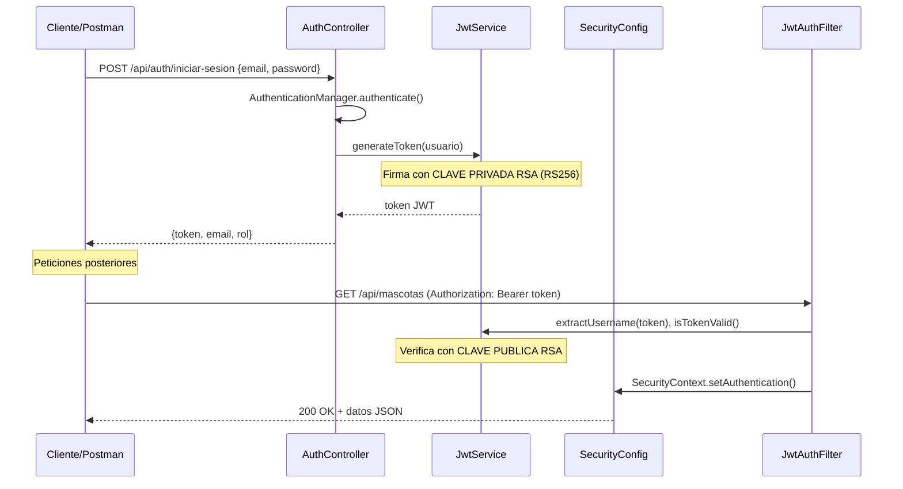

# Documento Técnico — Clínica Veterinaria API REST

**Autor:** Álvaro Ortega Benítez  
**Fecha:** Febrero 2026  
**Tecnologías:** Spring Boot 4.0.0, Spring Security 7, JWT, JPA/Hibernate, MySQL, Docker

---

## 1. Introducción

Sistema de gestión para una clínica veterinaria desarrollado como API REST. Permite la gestión de clientes, mascotas, veterinarios, citas y tratamientos con un sistema de autenticación basado en JWT y control de acceso por roles.

---

## 2. Transformación MVC → API REST

El proyecto se migró de una arquitectura Model-View-Controller con Thymeleaf (vistas HTML del servidor) a una API REST pura que devuelve JSON. A continuación se detallan los cambios realizados.

### 2.1. Controladores: `@Controller` → `@RestController`

| Antes (MVC) | Después (REST) |
|---|---|
| `@Controller` | `@RestController` |
| Métodos devolvían `String` (nombre de vista) | Métodos devuelven `ResponseEntity<T>` |
| Datos pasados con `Model.addAttribute()` | Datos devueltos directamente como JSON |
| Formularios HTML con Thymeleaf | Body JSON con validación `@Valid @RequestBody` |
| Verbos HTTP limitados (GET/POST) | Verbos semánticos: GET, POST, PUT, DELETE |

### 2.2. Eliminación de Thymeleaf

- Se eliminaron todas las plantillas HTML del directorio `templates/`.
- Se eliminó la dependencia `spring-boot-starter-thymeleaf` del `pom.xml`.
- Se eliminó `WebConfig` (resolución de vistas).

### 2.3. Nuevas clases creadas

#### 2.3.1. Capa de Seguridad (paquete `security`)

| Clase | Descripción |
|---|---|
| **`Usuario`** | Entidad JPA que implementa `UserDetails` de Spring Security. Almacena email, contraseña encriptada y rol (`VETERINARIO`/`CLIENTE`). Se vincula con `Cliente` o `Veterinario` mediante `@OneToOne`. |
| **`Rol`** | Enum con los valores `VETERINARIO` y `CLIENTE`. |
| **`UsuarioDetailsService`** | Implementa `UserDetailsService`. Carga un usuario por email desde la base de datos para que Spring Security autentique las credenciales. |
| **`JwtService`** | Servicio para generar, validar y extraer información de tokens JWT. Utiliza criptografía asimétrica RSA (RS256): firma con la clave privada y verifica con la clave pública. |
| **`JwtAuthFilter`** | Filtro que extiende `OncePerRequestFilter`. Intercepta cada petición HTTP, extrae el token JWT de la cabecera `Authorization: Bearer <token>`, lo valida y establece la autenticación en el `SecurityContext`. |
| **`SecurityConfig`** | Configura Spring Security: desactiva CSRF, sesiones stateless, CORS abierto, y define las reglas de autorización por rol y método HTTP. |
| **`KeyConfig`** | Clase `@Configuration` que carga un par de claves RSA desde un fichero Java KeyStore (`.jks`). La ruta, contraseña y alias se configuran en `application.properties`. El `KeyPair` resultante es inyectado en `JwtService`. |

#### 2.3.2. DTOs (paquete `dto`)

Los DTOs evitan la serialización circular de las relaciones JPA y controlan qué datos se exponen al cliente.

| DTO | Uso |
|---|---|
| `ClienteDTO` | Lectura/escritura de clientes |
| `VeterinarioDTO` | Lectura/escritura de veterinarios |
| `MascotaDTO` | Incluye `clienteId` y `clienteNombre` |
| `CitaVeterinariaDTO` | Incluye `mascotaId`, `veterinarioId`, lista de `TratamientoDTO` y `costeTotal` |
| `TratamientoDTO` | Incluye `citaId` |
| `DashboardDTO` | Estadísticas generales y últimas citas |
| `RegistroDTO` | Datos de registro (email, password, rol, campos según rol) |
| `LoginDTO` | Credenciales de login (email, password) |
| `AuthResponseDTO` | Respuesta de autenticación (token, email, rol) |

#### 2.3.3. Otras clases nuevas

| Clase | Descripción |
|---|---|
| **`GlobalExceptionHandler`** | `@RestControllerAdvice` que captura excepciones y devuelve errores JSON estandarizados (400, 404, 409, 500). |
| **`CorsConfig`** | Configuración CORS para permitir peticiones del frontend. |
| **`AuthController`** | Endpoints de registro y login con JWT. |
| **`HomeController`** | Endpoint del Dashboard con estadísticas. |
| **`ImagenService`** | Servicio para subir, descargar y borrar imágenes de mascotas. |
| **`DashboardService`** | Servicio que calcula estadísticas generales del sistema. |

### 2.4. Flujo de autenticación JWT



### 2.5. Proceso de registro de usuario

El endpoint `POST /api/auth/registro` gestiona el alta de nuevos usuarios. El body JSON se mapea al DTO `RegistroDTO`, que valida los campos obligatorios (`email`, `password`, `rol`, `nombre`, `apellidos`) y contiene campos opcionales según el rol.

**Pasos del método `registrar()` en `AuthController`:**

1. **Verificar duplicados** — Se busca en la tabla `usuario` si ya existe un registro con el mismo email. Si existe, se devuelve **400 Bad Request** para evitar duplicados.

2. **Crear el objeto `Usuario`** — Se instancia un nuevo `Usuario` con:
   - `email`: del formulario.
   - `password`: cifrada con **BCrypt** mediante `passwordEncoder.encode()`. Nunca se almacena en texto plano.
   - `rol`: el valor del enum `Rol` (`CLIENTE` o `VETERINARIO`).

3. **Crear la entidad asociada según el rol:**
   - **Si `CLIENTE`**: se crea un objeto `Cliente` con los datos personales (`nombre`, `apellidos`, `dni`, `telefono`, `direccion`), se guarda en la tabla `cliente` con `clienteRepository.save()`, y se vincula al `Usuario` mediante `usuario.setCliente(cliente)` (FK `cliente_id`).
   - **Si `VETERINARIO`**: se crea un `Veterinario` con los datos profesionales (`nombre`, `apellidos`, `numeroColegiado`, `email`, `especialidad`), se guarda en la tabla `veterinario`, y se vincula al `Usuario` mediante `usuario.setVeterinario(veterinario)` (FK `veterinario_id`).

4. **Guardar el `Usuario` en la BD** — `usuarioRepository.save(usuario)` persiste el registro con las FKs ya asignadas.

5. **Generar token JWT** — `jwtService.generateToken(usuario)` crea un token firmado con la clave privada RSA.

6. **Devolver respuesta** — Se responde con **200 OK** y un JSON `AuthResponseDTO` que contiene: `token`, `email` y `rol`.

**Diagrama de flujo:**

```
POST /api/auth/registro (JSON)
        │
        ▼
  ¿Email ya existe? ──Sí──► 400 Bad Request
        │
       No
        ▼
  Crear Usuario (password cifrada con BCrypt)
        │
        ├── Rol = CLIENTE ──► Crear Cliente → save() → asociar a Usuario (FK cliente_id)
        │
        └── Rol = VETERINARIO ──► Crear Veterinario → save() → asociar a Usuario (FK veterinario_id)
        │
        ▼
  usuarioRepository.save(usuario)
        │
        ▼
  jwtService.generateToken(usuario)
        │
        ▼
  Respuesta: { token, email, rol }
```

---

## 3. Control de Acceso por Roles

### 3.1. Reglas de Spring Security

```
/api/auth/**          → Público (sin token)
POST /api/**          → Solo VETERINARIO
PUT /api/**           → Solo VETERINARIO
DELETE /api/**        → Solo VETERINARIO
Cualquier otra        → Autenticado (VETERINARIO o CLIENTE)
```

### 3.2. Filtrado de datos por rol en controllers

| Recurso | VETERINARIO | CLIENTE |
|---|---|---|
| Dashboard | Completo | Completo |
| Veterinarios | Todos | Todos |
| Clientes | Todos | Solo su propio perfil |
| Mascotas | Todas | Solo las suyas |
| Citas | Todas | Solo citas de sus mascotas |
| Tratamientos | Todos | Solo de sus mascotas |
| Crear/Editar/Eliminar | ✅ Todo | ❌ Prohibido |

---

## 4. Catálogo de Endpoints

### 4.1. Autenticación (`/api/auth`)

| Método | Endpoint | Auth | Descripción |
|--------|----------|------|-------------|
| `POST` | `/api/auth/registro` | ❌ Pública | Registro de nuevo usuario |
| `POST` | `/api/auth/iniciar-sesion` | ❌ Pública | Login, devuelve JWT |

#### Registro — Request Body:
```json
{
  "email": "user@mail.com",
  "password": "123456",
  "rol": "VETERINARIO",
  "nombre": "Carlos",
  "apellidos": "García",
  "numeroColegiado": "COL-001",
  "especialidad": "Cirugía"
}
```

#### Login — Request Body:
```json
{
  "email": "user@mail.com",
  "password": "123456"
}
```

#### Respuesta de autenticación:
```json
{
  "token": "eyJhbGciOiJSUzI1NiJ9...",
  "email": "user@mail.com",
  "rol": "VETERINARIO"
}
```

---

### 4.2. Dashboard (`/api/dashboard`)

| Método | Endpoint | Auth | Descripción |
|--------|----------|------|-------------|
| `GET` | `/api/dashboard` | 🔒 Autenticado | Estadísticas generales y últimas 5 citas |

---

### 4.3. Clientes (`/api/clientes`)

| Método | Endpoint | Auth | Parámetros | Descripción |
|--------|----------|------|------------|-------------|
| `GET` | `/api/clientes` | 🔒 Auth | `page`, `size`, `sort`, `search` | Listar clientes (paginado) |
| `GET` | `/api/clientes/{id}` | 🔒 Auth | — | Obtener cliente por ID |
| `POST` | `/api/clientes` | 🔑 VET | Body JSON | Crear cliente |
| `PUT` | `/api/clientes/{id}` | 🔑 VET | Body JSON | Actualizar cliente |
| `DELETE` | `/api/clientes/{id}` | 🔑 VET | — | Eliminar cliente |

#### Body JSON (POST/PUT):
```json
{
  "nombre": "María",
  "apellidos": "Fernández Ruiz",
  "dni": "12345678A",
  "telefono": "600123456",
  "direccion": "Calle Mayor 10",
  "email": "maria@mail.com"
}
```

---

### 4.4. Veterinarios (`/api/veterinarios`)

| Método | Endpoint | Auth | Parámetros | Descripción |
|--------|----------|------|------------|-------------|
| `GET` | `/api/veterinarios` | 🔒 Auth | `page`, `size`, `sort`, `search` | Listar veterinarios (paginado) |
| `GET` | `/api/veterinarios/{id}` | 🔒 Auth | — | Obtener veterinario por ID |
| `GET` | `/api/veterinarios/especialidades` | 🔒 Auth | — | Lista de especialidades |
| `POST` | `/api/veterinarios` | 🔑 VET | Body JSON | Crear veterinario |
| `PUT` | `/api/veterinarios/{id}` | 🔑 VET | Body JSON | Actualizar veterinario |
| `DELETE` | `/api/veterinarios/{id}` | 🔑 VET | — | Eliminar veterinario |

#### Body JSON (POST/PUT):
```json
{
  "nombre": "Carlos",
  "apellidos": "García López",
  "numeroColegiado": "COL-001",
  "especialidad": "Cirugía",
  "email": "carlos@clinica.com"
}
```

---

### 4.5. Mascotas (`/api/mascotas`)

| Método | Endpoint | Auth | Parámetros | Descripción |
|--------|----------|------|------------|-------------|
| `GET` | `/api/mascotas` | 🔒 Auth | `page`, `size`, `sort`, `search` | Listar mascotas (paginado) |
| `GET` | `/api/mascotas/{id}` | 🔒 Auth | — | Obtener mascota por ID |
| `POST` | `/api/mascotas` | 🔑 VET | Body JSON | Crear mascota |
| `PUT` | `/api/mascotas/{id}` | 🔑 VET | Body JSON | Actualizar mascota |
| `DELETE` | `/api/mascotas/{id}` | 🔑 VET | — | Eliminar mascota |
| `POST` | `/api/mascotas/{id}/imagen` | 🔑 VET | `file` (multipart) | Subir imagen |
| `GET` | `/api/mascotas/imagen/{fileName}` | 🔒 Auth | — | Descargar imagen |

#### Body JSON (POST/PUT):
```json
{
  "nombre": "Rex",
  "especie": "Perro",
  "raza": "Pastor Alemán",
  "fechaNacimiento": "2022-03-15",
  "peso": 30.5,
  "clienteId": 1
}
```

---

### 4.6. Citas Veterinarias (`/api/citas`)

| Método | Endpoint | Auth | Parámetros | Descripción |
|--------|----------|------|------------|-------------|
| `GET` | `/api/citas` | 🔒 Auth | `page`, `size`, `sort`, `search` | Listar citas (paginado) |
| `GET` | `/api/citas/{id}` | 🔒 Auth | — | Obtener cita con tratamientos |
| `POST` | `/api/citas` | 🔑 VET | Body JSON | Crear cita |
| `PUT` | `/api/citas/{id}` | 🔑 VET | Body JSON | Actualizar cita |
| `DELETE` | `/api/citas/{id}` | 🔑 VET | — | Eliminar cita |

#### Body JSON (POST/PUT):
```json
{
  "fechaHora": "2026-03-01T10:00:00",
  "motivo": "Vacunación anual",
  "diagnostico": "Sano",
  "estado": "Pendiente",
  "mascotaId": 1,
  "veterinarioId": 1
}
```

---

### 4.7. Tratamientos (`/api/tratamientos`)

| Método | Endpoint | Auth | Parámetros | Descripción |
|--------|----------|------|------------|-------------|
| `GET` | `/api/tratamientos` | 🔒 Auth | `page`, `size`, `sort`, `search` | Listar tratamientos (paginado) |
| `GET` | `/api/tratamientos/{id}` | 🔒 Auth | — | Obtener tratamiento por ID |
| `GET` | `/api/tratamientos/cita/{citaId}` | 🔒 Auth | — | Tratamientos de una cita |
| `POST` | `/api/tratamientos` | 🔑 VET | Body JSON | Crear tratamiento |
| `PUT` | `/api/tratamientos/{id}` | 🔑 VET | Body JSON | Actualizar tratamiento |
| `DELETE` | `/api/tratamientos/{id}` | 🔑 VET | — | Eliminar tratamiento |

#### Body JSON (POST/PUT):
```json
{
  "descripcion": "Vacuna antirrábica",
  "medicamento": "Rabisin",
  "precio": 35.00,
  "observaciones": "Aplicada sin incidencias",
  "citaId": 1
}
```

---

## 5. Parámetros de paginación, búsqueda y ordenación

Todos los endpoints de listado (`GET`) soportan:

| Parámetro | Tipo | Default | Descripción |
|-----------|------|---------|-------------|
| `page` | int | 0 | Número de página (0-indexed) |
| `size` | int | 10 | Elementos por página |
| `sort` | String | "id" | Campo de ordenación |
| `search` | String | null | Texto de búsqueda (filtra por campos relevantes) |

**Ejemplo:** `GET /api/mascotas?page=0&size=5&sort=nombre&search=Rex`

---

## 6. Códigos de respuesta HTTP

| Código | Significado | Uso |
|--------|-------------|-----|
| `200` | OK | Lectura/actualización exitosa |
| `201` | Created | Creación exitosa |
| `204` | No Content | Eliminación exitosa |
| `400` | Bad Request | Error de validación en los campos |
| `403` | Forbidden | Sin permiso (rol insuficiente o sin token) |
| `404` | Not Found | Entidad no encontrada |
| `409` | Conflict | Datos duplicados (DNI, email, etc.) |
| `500` | Internal Server Error | Error interno |

---

## 7. Estructura del proyecto

```
src/main/java/com/OrtegaAlvaro/ClinicaVeterinaria/
├── config/
│   ├── CorsConfig.java              # Configuración CORS
│   ├── DotenvConfig.java            # Variables de entorno
│   ├── GlobalExceptionHandler.java  # Manejo global de errores
│   ├── KeyConfig.java               # Carga KeyPair RSA desde keystore .jks
│   └── SecurityConfig.java          # Configuración Spring Security
├── controllers/
│   ├── AuthController.java          # Registro y login
│   ├── HomeController.java          # Dashboard
│   ├── ClienteController.java       # CRUD Clientes
│   ├── VeterinarioController.java   # CRUD Veterinarios
│   ├── MascotaController.java       # CRUD Mascotas + imágenes
│   ├── CitaVeterinariaController.java # CRUD Citas
│   └── TratamientoController.java   # CRUD Tratamientos
├── dto/
│   ├── AuthResponseDTO.java         # Respuesta auth
│   ├── LoginDTO.java                # Request login
│   ├── RegistroDTO.java             # Request registro
│   ├── DashboardDTO.java            # Dashboard
│   ├── ClienteDTO.java
│   ├── VeterinarioDTO.java
│   ├── MascotaDTO.java
│   ├── CitaVeterinariaDTO.java
│   └── TratamientoDTO.java
├── entities/
│   ├── Usuario.java                 # UserDetails + JPA
│   ├── Rol.java                     # Enum VETERINARIO/CLIENTE
│   ├── Cliente.java
│   ├── Veterinario.java
│   ├── Mascota.java
│   ├── CitaVeterinaria.java
│   └── Tratamiento.java
├── repositories/                    # Interfaces JPA
├── security/
│   ├── JwtAuthFilter.java           # Filtro JWT
│   ├── JwtService.java              # Generación/validación JWT (RSA RS256)
│   └── UsuarioDetailsService.java   # Carga de usuario
├── services/                        # Lógica de negocio
└── ClinicaVeterinariaApplication.java
```

---

## 8. Tecnologías y dependencias

| Dependencia | Versión | Uso |
|---|---|---|
| Spring Boot | 4.0.0 | Framework principal |
| Spring Security | 7 | Autenticación y autorización |
| Spring Data JPA | — | Persistencia con Hibernate |
| JJWT (io.jsonwebtoken) | 0.12.x | Tokens JWT |
| MySQL Connector | — | Driver de base de datos |
| Lombok | — | Reducción de boilerplate |
| Docker Compose | — | Contenedor MySQL |
| BCrypt | — | Encriptación de contraseñas |

---

## 9. Ejecución

```bash
# 1. Levantar la base de datos con Docker
docker compose up -d

# 2. Ejecutar la aplicación
./mvnw spring-boot:run

# La API estará disponible en http://localhost:8080
```
